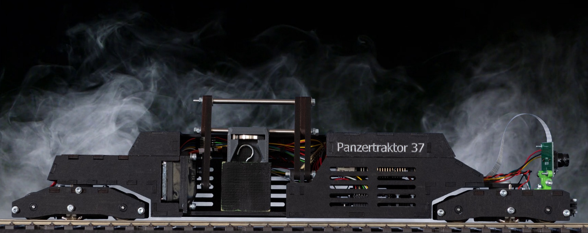
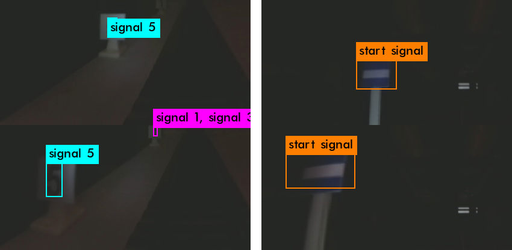
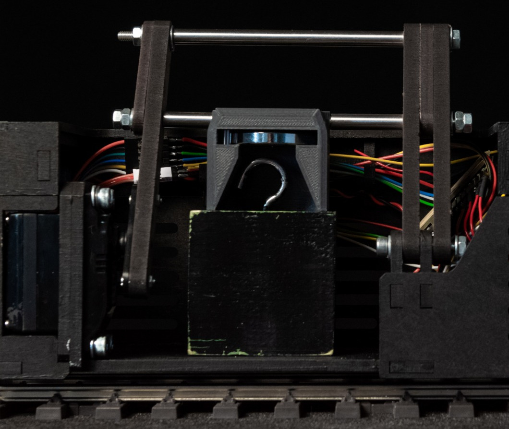

# PREN 2019 - Panzertraktor 37

Documents:
- [Presentation slides](doc/pren2_praesentation.pdf) (German)

## Project overview

The goal of the project was to develop a prototype of a train like vehicle that can drive on rails. Hardware and software was custom made for this project.

The prototype should be able to...
- pick up a wooden cube from the ground next to the rails
- drive 2 rounds on the track as fast as possible
- recognize signals with differnet digits in different colors on them, that are located next to the rails
    - signals on a pole provide info about where to stop (only 1 exists)
    - signals close to the ground mark possible stopping locations (multiple signals with different digits)
- stop at a location determined by the recognized digit on the signal

## Facts & Numbers

At the final Presentation, our prototype achieved the following results:

Speed  | Info signal correctly detected | Stop at the correct position | Pick up Cube | Ranking
-------|--------------------------------|------------------------------|--------------|-----------------
1.9m/s | Successful                     | Failed                       | Successful   | Rank 6 out of 27 teams

Our team consisted of 2 mechanical engineers, 2 electircal engineers and 2 software engineers.

## Signal detection
Done by the software engineers: [boardcomputer source code](https://github.com/eddex/pren2/tree/master/src/boardcomputer)

The numbers on the signals and the special "start-signal" are detected with a custom trained neural network based on the [YOLOv3 Tiny](https://pjreddie.com/darknet/yolo/) architecture.

An Intel Neural Compute Stick 2 was used to accelerate inference on the Raspberry Pi. With that we were able to process ~10 frames per second.

We detect the numbers 1 to 9 and the "start-signal". The position of the objects (upper or lower half of the frame) determines if the signal is an info- or a stop-signal.

Because the camera is able to take more than 10 images / second and we need to analyze as many images as possible due to the high speed, the images are spilt in half and 2 consecutive frames are merged into one image. Like this the amount of images processed is almost doubled!

A complete guide on how we did the signal detection can be found in here: [https://github.com/eddex/tiny-yolov3-on-intel-neural-compute-stick-2](https://github.com/eddex/tiny-yolov3-on-intel-neural-compute-stick-2)

## Picking up the cube
Done by the electrical and mechanical engineers: [microcontroller source code](https://github.com/eddex/pren2/tree/master/src/microcontroller)

The cube is detected with a Time of Flight (ToF) sensor and then picked up by a magnet. The magnet is moved outwards on top of the wooden cube. It then attracts the iron hook on top of the wooden cube and is pulled back in again by the servo motor.

